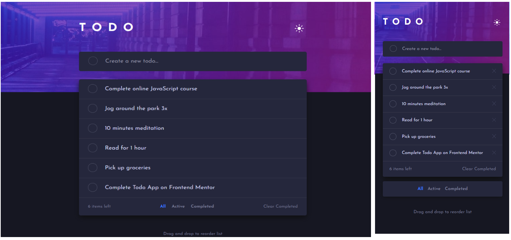

<h1 align="center">
  Frontend Mentor - TODO
</h1>

<h3 align="center">
<strong>Project based on <a href="https://www.frontendmentor.io/challenges/todo-app-Su1_KokOW" target="_blank">Frontend Mentor</a></strong>
</h3>

  
  
  
  
   
   
  <a href="#space_invader-technologies">Technologies</a>
   
   
  
   
  
   
  <h3 align="center">
    <strong>
      <a href="https://shiga-todo-app.netlify.app/" target="_blank">
        visit
      </a>
    </strong>
  </h3>

## :space_invader: Technologies

- Angular
- HTML
- SASS
- Typescript
